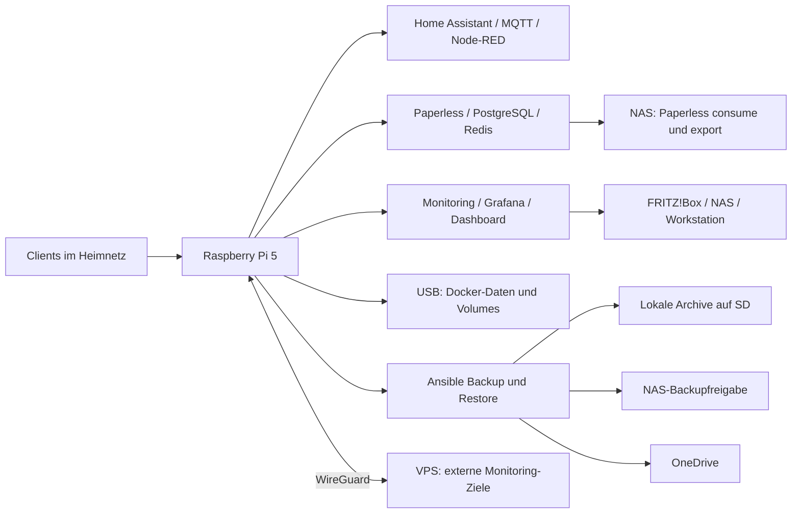

# Infrastruktur: Raspberry Pi, Services und Wiederherstellung

Stand: **19. September 2026**. Dieses Repository dokumentiert und verwaltet die
Infrastruktur auf Karstens Raspberry Pi 5. Die Übersicht basiert auf den aktiven
Compose-Projekten, Host-Diensten, Mounts und Zeitplänen. Externe Systeme sind hier
als Abhängigkeiten und Monitoring-Ziele beschrieben; ihre vollständige
Konfiguration wird nicht in diesem Repository verwaltet.

## Einstieg

| Anliegen | Dokumentation |
| --- | --- |
| Ausfall, Ersatzhost oder Datenwiederherstellung | [Disaster Recovery](DISASTER_RECOVERY.md) |
| Versionierte Service-Konfigurationen übernehmen | [Service-Konfigurationen](services/README.md) |
| Speicherabhängigkeiten, Updates und Systemd installieren | [Host-Verwaltung](system/README.md) |
| Frühere Wiederherstellungsproben nachvollziehen | [Historische Testnachweise](docs/RECOVERY_HISTORY_2026-09-18.md) |

## Gesamtaufbau



### Host und Speicher

| Komponente | Aktueller Aufbau |
| --- | --- |
| Rechner | Raspberry Pi 5, Hostname `paperless`, Architektur `aarch64` |
| Betriebssystem | Debian GNU/Linux 12 (Bookworm) |
| Benutzer / Arbeitsverzeichnis | `karsten`, `/home/karsten` |
| Repository | `/home/karsten/ansible-playbooks`, Branch `main` |
| Netzwerk | LAN `192.168.0.199`, WireGuard `wg0` mit `10.8.0.2/24` |
| Zeitzone | `Europe/Berlin` |
| SD-Karte | Rund 118 GiB; Betriebssystem, Home-Verzeichnis, lokale Backup-Archive |
| USB-Laufwerk | Rund 233 GiB ext4 unter `/mnt/usb` |
| Docker-Datenverzeichnis | `/mnt/usb/docker` |
| NAS | WD EX4100, `nas-labor.fritz.box`, `192.168.0.7` |

Die Compose-Verzeichnisse liegen unter `/home/karsten`. Dadurch liegen dortige
Bind-Mount-Daten, etwa Home-Assistant-Konfiguration und Dashboard-Datenbank, auf
der SD-Karte. Docker-Named-Volumes liegen dagegen im Docker-Datenverzeichnis auf
USB. Ein USB-Backup allein deckt die Service-Daten daher nicht vollständig ab.

| NAS-Freigabe | Mountpunkt | Verwendung |
| --- | --- | --- |
| `//nas-labor.fritz.box/paperless` | `/mnt/paperless` | Paperless `consume` und `export` |
| `//nas-labor.fritz.box/backups` | `/mnt/backups` | Backup-Replikate |
| `//nas-labor.fritz.box/Public` | `/mnt/public` | Allgemeine Dateien |

Paperless-Dokumente und PostgreSQL-Daten liegen in Docker-Volumes; die NAS-Freigabe
ist für Eingang und Export eingebunden. Die SMB-Zugangsdaten liegen privat in
`/etc/smb_credentials` (0600). Fstab verwendet NAS-Automounts. Docker verlangt den
USB-Mount; Paperless zusätzlich seinen CIFS-Mount. Die Paperless-Bind-Mounts haben
`create_host_path: false`, damit fehlende NAS-Pfade nicht still lokal entstehen.

## Services

Es laufen **drei Compose-Projekte mit insgesamt 13 Containern**. Befehle werden
in den jeweiligen Live-Verzeichnissen ausgeführt, nicht in `services/` im Git-Repo.

### Home Assistant

Live-Verzeichnis: `/home/karsten/homeassistant`.
[Compose-Konfiguration](services/homeassistant/docker-compose.yml)

| Container | Aufgabe | Zugang |
| --- | --- | --- |
| `homeassistant` | Smart-Home-Zentrale und Integrationen | `http://192.168.0.199:8123` |
| `mqtt` | Mosquitto MQTT-Broker | MQTT, entsprechend privater Broker-Konfiguration |
| `nodered` | Automatisierungsabläufe | `http://192.168.0.199:1880` |

Home Assistant und Mosquitto verwenden das Host-Netzwerk. Node-RED veröffentlicht
Port 1880. Konfiguration, MQTT-Daten und Node-RED-Flows werden mit dem vollständigen
Service-Verzeichnis gesichert. Home Assistant benötigt Host-D-Bus und lokale
Zeitinformationen; bei einem Ersatzhost sind außerdem Integrationen und
gegebenenfalls angeschlossene Hardware zu prüfen.

### Paperless

Live-Verzeichnis: `/home/karsten/paperless`.
[Compose-Konfiguration](services/paperless/docker-compose.yml)

| Container | Aufgabe | Zugang |
| --- | --- | --- |
| `paperless-ngx` | Dokumentenverwaltung und OCR | `http://192.168.0.199:8000` |
| `paperless-db` | PostgreSQL 16 | Internes Compose-Netzwerk, kein veröffentlichter DB-Port |
| `paperless-redis` | Redis 7 | Internes Compose-Netzwerk, kein veröffentlichter Redis-Port |

Die öffentliche Adresse `https://paperless.karikarstus.de/` wird zusätzlich
überwacht. VPS/Traefik-Metriken sind über WireGuard eingebunden; die vollständige
externe Proxy- und DNS-Konfiguration ist nicht Bestandteil dieses Repositories.

Die private `.env` enthält die Laufzeitkonfiguration. Vier verwendete Named-Volumes
sichern Anwendungsdaten, Medien, PostgreSQL und Redis. NAS-Verzeichnisse sind als
externe Bind-Mounts Teil des Backups. `paperless.service` ergänzt Docker-Autostart
um Mount-Abhängigkeiten und wartet auf den gesunden Compose-Start.

### Monitoring und Home-Dashboard

Live-Verzeichnis: `/home/karsten/monitoring`.
[Compose-Konfiguration](services/monitoring/docker-compose.yml)

| Container | Aufgabe | Endpunkt |
| --- | --- | --- |
| `monitoring-prometheus` | Metriken sammeln und speichern | Port 9090 |
| `monitoring-grafana` | Infrastruktur- und Restore-Dashboards | Port 3000 |
| `monitoring-node-exporter` | Host- und Textfile-Metriken | Port 9100 |
| `monitoring-blackbox` | HTTP-, DNS- und ICMP-Prüfungen | Port 9115 |
| `monitoring-fritz-exporter` | FRITZ!Box-Metriken | Port 9787 |
| `monitoring-snmp-exporter` | NAS-Abfragen per SNMP | `127.0.0.1:9116` |
| `monitoring-home-dashboard` | Eigenes Web-Dashboard | Port 3080, Healthcheck `/health` |

Das Monitoring verwendet Host-Netzwerk. Die Portliste beschreibt die konfigurierten
Dienste, keine Freigabeempfehlung für das Internet. Prometheus behält Daten für
maximal 14 Tage beziehungsweise bis zum Größenlimit von 10 GB. Prometheus und
Grafana nutzen Named-Volumes. Das Home-Dashboard wird aus dem versionierten
Python-/Web-Quellcode gebaut und verwendet `home-dashboard/data/events.db`.
Es gehört zum Monitoring-Projekt und wird gemeinsam mit ihm gesichert.

Überwacht werden der Pi, lokale Webdienste, die FRITZ!Box, das NAS, die
Windows-Workstation `192.168.0.195:9182`, VPS-Hostmetriken `10.8.0.1:9100`,
Traefik-Metriken `10.8.0.1:8082`, die externe Paperless-Adresse sowie Internet-
und DNS-Erreichbarkeit. Konfigurierte Ziele sind nicht zwangsläufig jederzeit online.

Host-Collector-Skripte schreiben Backup-, Infrastruktur-, NAS- und Restore-Werte
nach `monitoring/textfile/`. Node-exporter stellt diese für Prometheus bereit.
Grafana provisioniert die Infrastruktur-Dashboards sowie `Restore Verification`
unter `/d/restore-verification`.

## Weitere Host-Dienste und Entwicklungsumgebung

- **WireGuard:** `wg-quick@wg0` ist aktiv; Verbindung zum VPS-Netz `10.8.0.0/24`.
- **SSH und VS Code Remote:** Administration und Bearbeitung auf dem Pi.
- **libvirt/KVM:** Die VM `restore-drill` ist vorhanden und zum Prüfzeitpunkt
  ausgeschaltet. Sie dient isolierten Wiederherstellungsproben.
- **Apache:** Seit 19. September 2026 gestoppt und deaktiviert. Es war nur der
  Default-VHost vorhanden; Konfiguration und Paket bleiben für eine Rücknahme erhalten.
- **Host-Grunddienste:** Unter anderem NetworkManager, Avahi, Bluetooth, Cron,
  Zeitsynchronisation, journald sowie Docker/containerd.
- **Entwicklungswerkzeuge:** .NET/NuGet und weitere Werkzeuge sind installiert;
  ihre Verzeichnisse sind keine nachgewiesenen Altlasten und wurden beibehalten.

XMLTV, TVHeadend/DVB-C-Nutzung und die DVB-C-VM gehören nicht mehr zum aktiven
Betrieb. Alte Jellyfin-/ConvertX-Beispiele beschreiben ebenfalls nicht den aktuellen
Servicebestand. Veraltete Editor-Versionen, Testreste und temporäre Dateien wurden
bereinigt; die Löschprotokolle liegen privat unter `backups/cleanup-*.json`.

## Automatisierung und Wartung

Die Host-Firewall verwaltet IPv4 und IPv6 mit `iptables-nft` und
`netfilter-persistent`. LAN-Eingänge sind `eth1` und `br0` (über `eth0`) /
`192.168.0.0/24`, VPN ist `wg0` /
`10.8.0.0/24`. SSH, Home Assistant, Paperless, Grafana und Dashboard sind für LAN
und VPN freigegeben; Node-RED und go2rtc (18555) nur für LAN. IPv6-Zugriffe sind
derzeit auf das Link-Local-LAN begrenzt. Prometheus und Exporter sind durch die
Firewall nur lokal erreichbar; ihre Listen-Adressen sind unverändert.
Docker-Veröffentlichungen werden zusätzlich in `DOCKER-USER` gefiltert.
Details, Tests und Rücknahme: [Firewall-Betrieb](system/FIREWALL.md).

Alle Uhrzeiten gelten für `Europe/Berlin`.

| Auslöser | Aufgabe |
| --- | --- |
| `homeassistant-backup.timer`, täglich 01:00 | Home-Assistant-Backup |
| `paperless-backup.timer`, täglich 01:20 | Paperless-Backup |
| `monitoring-backup.timer`, täglich 02:00 | Monitoring-Backup |
| `system-update.timer`, Samstag 03:30 | `scripts/system-update.sh`: Backups, danach OS-/Paperless-Updates |
| `infrastructure-health.timer`, jede Minute | Infrastruktur-Metriken |
| `ex4100-health.timer`, alle 5 Minuten | NAS-Zustand |
| `backup-metrics.timer`, alle 15 Minuten | Backup-Metriken |
| `restore-check.timer`, Sonntag 04:30 + bis zu 10 Minuten | Isolierte Restore-Prüfungen; Quelle rotiert |

Zusätzlich existieren die normalen Betriebssystem-Timer, etwa für APT, Logrotation,
Trim und temporäre Dateien. Der eigene Updater führt zunächst Backups aller drei
Stacks durch. Ein Backup-/Replikationsfehler verhindert das Update. Anschließend
werden OS-Pakete und Paperless-Images aktualisiert; Home-Assistant- und Monitoring-
Images werden von diesem Skript nicht automatisch aktualisiert.

Die Backup- und Update-Zeitpläne wurden am 19. September 2026 von Cron auf die
deklarativen Systemd-Timer migriert. Die vorherigen Crontabs liegen root-only unter
`/root/host-baseline-recovery/`; der nicht mehr benötigte automatische Monatsneustart
wurde dabei entfernt.

Vorherige Paperless-Images und passende Archive werden für eine kontrollierte
Wiederherstellung festgehalten. Es gibt keinen automatischen Datenbank-Downgrade.
Der Backup-Wrapper und die Update-Phase verwenden eine gemeinsame Sperre.
Alle aktuellen Container begrenzen stdout/stderr über den Docker-Logging-Treiber
`local` auf drei Dateien à 10 MB; Anwendungsdateien in Volumes sind davon unabhängig.

## Backup und Disaster Recovery

| Kopie | Pfad je `<service>` | Aufbewahrung |
| --- | --- | --- |
| Lokal | `/home/karsten/backups/<service>_backups` | 3 Archive |
| NAS | `/mnt/backups/<service>` | 30 Archive |
| OneDrive | `onedrive:backups/<service>_backups` | 7 Archive |

Ein Backup enthält das vollständige Service-Verzeichnis einschließlich privater
Konfiguration, verwendete Named-Volumes, beschreibbare externe Bind-Mounts und ein
Manifest. Der jeweilige Stack wird für die Sicherung gestoppt und danach wieder
gestartet. Registry-Images selbst und eine vollständige Host-Installation sind
nicht enthalten. Die Archive sind **nicht clientseitig verschlüsselt** und dürfen
nicht in das öffentliche Git-Repository gelangen.

Lokale Sicherung und entfernte Ziele werden getrennt behandelt: Ein nicht
verfügbares Backup-NAS verhindert den OneDrive-Versuch nicht. Dennoch endet der
Job bei einem fehlgeschlagenen aktivierten Ziel mit Fehler. Benötigte Quelldaten,
insbesondere Paperless auf dem NAS, müssen für ein vollständiges Backup verfügbar sein.

Restore-Modi: `validate` prüft Archive, `portable_test` rekonstruiert isolierte
Daten, `test` prüft zusätzlich Paperless-PostgreSQL, `install` installiert nur in
leere Ziele mit expliziter Bestätigung. Destruktives In-place-Restore ist deaktiviert.
Neue Manifeste ermöglichen die Wiederherstellung mit aufgezeichneten Image-Digests.

Die wöchentlichen Prüfungen rotieren zwischen lokal, NAS und OneDrive. Vollständige
lokale Prüfungen aller drei Stacks einschließlich Paperless-SQL-Test sind belegt.
Sie ersetzen keinen vollständigen Wiederanlauf aller Anwendungen oder des Hosts.
Die verbindliche Reihenfolge, Voraussetzungen und getesteten Archive stehen in
[DISASTER_RECOVERY.md](DISASTER_RECOVERY.md).

## Repository und private Laufzeitdaten

```text
ansible-playbooks/
├── README.md                     # Diese Infrastrukturübersicht
├── DISASTER_RECOVERY.md           # Aktuelle Wiederherstellungsanleitung
├── services/                     # Konfigurations-Snapshots und Dashboard-Quellcode
├── docker/                       # Backup-/Restore-Playbooks, Wrapper, VM-Drill
├── roles/docker_backup/          # Archivierung, Replikation, Aufbewahrung
├── roles/docker_restore/         # Validierung, Tests, leere Zielinstallation
├── system/                       # Host-Playbooks, Skripte, Systemd-Dateien und Tests
└── docs/                         # Historische Wiederherstellungsnachweise
```

`services/` ist die versionierte Vorlage, kein automatisch synchronisiertes
Live-Verzeichnis. Änderungen müssen bewusst übernommen und geprüft werden.
Private `.env`-Dateien, Exporter-Zugangsdaten, Home-Assistant-Konfiguration,
Datenbanken und Archive bleiben außerhalb von Git. SNMP-Konfigurationen sind als
Vorlagen mit `ex4100_snmp_community` abgelegt. Bereits versionierte Host-Geheimnisse
in `system/files/` sind mit Ansible Vault verschlüsselt; für Recovery werden das
Vault-Passwort und gegebenenfalls aktuellere Live-Zugangsdaten separat benötigt.

## Häufige Betriebsbefehle

Lesende Zustandsprüfung:

```sh
cd /home/karsten/ansible-playbooks
docker ps --format 'table {{.Names}}\t{{.Status}}'
systemctl --failed
systemctl list-timers --all
sudo /home/karsten/scripts/system-update.sh --check
/home/karsten/scripts/restore-check.py --plan
```

Manuelles Backup (mit kurzer Service-Unterbrechung) und isolierte Validierung:

```sh
./docker/run-ansible.sh backup.yml -e service_name=paperless
./docker/run-ansible.sh restore.yml -e service_name=paperless \
  -e restore_mode=validate -e restore_source=local
```

Diagnose:

```sh
tail -n 80 /home/karsten/backups/logs/paperless_backup.log
journalctl -u restore-check.service -n 60 --no-pager
cd /home/karsten/monitoring
docker compose logs --tail=80 home-dashboard
```

## Noch offene Punkte

Der Neustart am 19. September 2026 wurde erfolgreich geprüft: Firewall vor Docker,
USB- und NAS-Mounts, WireGuard, alle 13 Container und Timer sind aktiv; eine neue
LAN-SSH-Verbindung ist hergestellt. Alle 14 Monitoring-Ziele melden „up“.
Ein vollständiger Bare-Metal-Wiederaufbau bleibt offen. Für Monitoring fehlt
ein kompletter Ersatzhost-Installations-/Starttest. Der erfolgreiche Boot mit
verfügbarem USB/NAS ersetzt keinen Ausfalltest dieser Speichergeräte.
Vollständige VPS-/Proxy-/DNS-Konfigurationen sowie
Geräte- und Integrationsinventare von Home Assistant sind hier nicht erfasst.
Diese Grenzen sind bei einer Wiederherstellung zu berücksichtigen.
